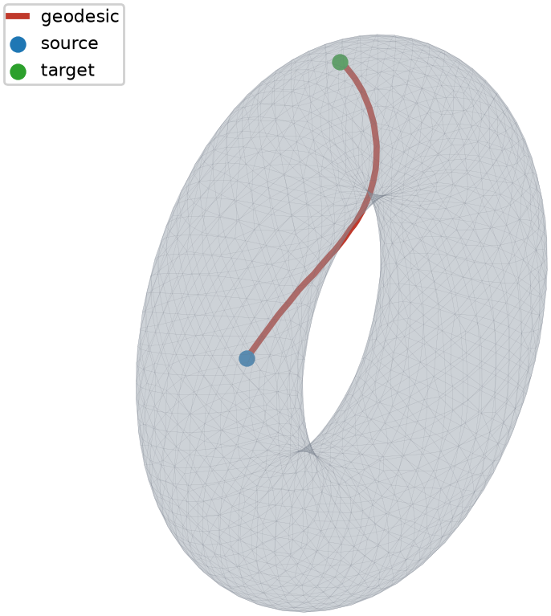
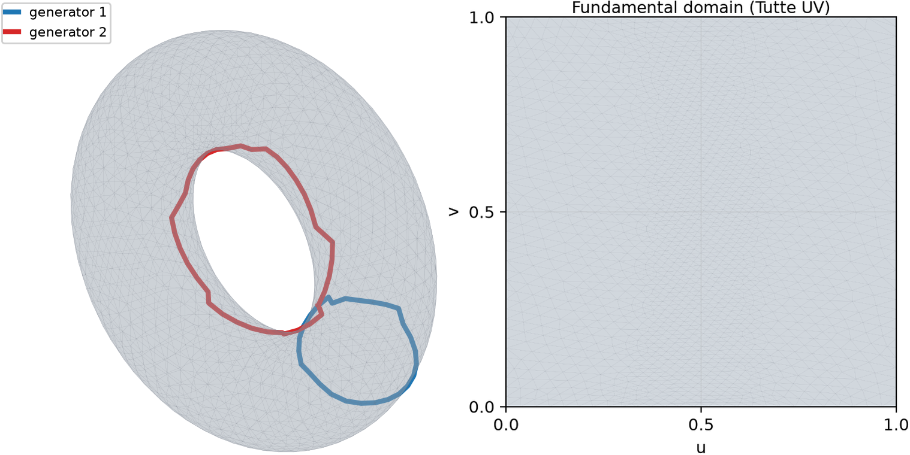

# ShapeComp

C++ and Python tools for comparing shapes and surfaces.

Supports mesh I/O, surface representations, geodesics, topology/homotopy helpers,
planar location, and reusable comparison primitives, with Python bindings.

## Prerequisites

Native dependencies (Ubuntu/Debian packages or Conda equivalents):

- CMake, Ninja, a C++17 compiler
- CGAL
- Boost program_options
- ANN (`libann-dev` / `conda-forge::ann`)

Git submodules used by the build: Eigen, geometry-central, and Taskflow
(HTTPS URLs in `.gitmodules`).

## Installation

```bash
git clone --recurse-submodules git@github.com:YuanL12/shapecomp.git
cd shapecomp
```

### uv

```bash
uv venv --python 3.12
CMAKE_ARGS="-DTF_BUILD_TESTS=OFF -DTF_BUILD_EXAMPLES=OFF -DSUITESPARSE=OFF" \
  uv pip install -e .
```

### pip / Micromamba

```bash
CMAKE_ARGS="-DTF_BUILD_TESTS=OFF -DTF_BUILD_EXAMPLES=OFF -DSUITESPARSE=OFF" \
  python -m pip install -e .
```

Portable binary wheels are not claimed yet: the extension links against system
ANN and GMP.

### C++ only

```bash
cmake -S . -B build -G Ninja \
  -DSHAPECOMP_BUILD_TESTS=ON \
  -DTF_BUILD_TESTS=OFF \
  -DTF_BUILD_EXAMPLES=OFF \
  -DSUITESPARSE=OFF
cmake --build build
ctest --test-dir build --output-on-failure
```

## Usage

```python
import shapecomp as sc

mesh = sc.load_mesh("test/input/torus/torus.obj", False)
V, F = mesh.get_vertices(), mesh.get_faces()
assert V.shape[1] == F.shape[1] == 3
```

### Geodesics

Compute an exact geodesic path between two surface points (face index +
barycentric coordinates):

```python
geodesic_mana = sc.GeodesicsManager(V, F)
source_surface_pt = [10, [0.5, 0.3, 0.2]]
target_surface_pt = [1800, [0.4, 0.4, 0.2]]
pts_on_path = geodesic_mana.find_exact_geodesic_path(
    source_surface_pt[0],
    target_surface_pt[0],
    source_surface_pt[1],
    target_surface_pt[1],
)
# pts_on_path is an (n, 3) array of points along the geodesic
```



### Torus fundamental domain (parameterization)

`PlanarLocator` uses ReebHanTun to find a pair of generators, cuts the torus
along them, and builds a planar Tutte parameterization of the fundamental
domain:

```python
planar = sc.PlanarLocator()
planar.constructPlanarLocatorReebGraph(mesh)
gen1_3d, gen2_3d = planar.get_generator_paths_3d()
uv = planar.get_uv_positions()
faces_cut = planar.get_cutted_mesh_faces()
```



## License

See `LICENSE`. Third-party components (ReebHanTun, ANN, CGAL, Boost, Eigen,
geometry-central, Taskflow) retain their own licenses.
